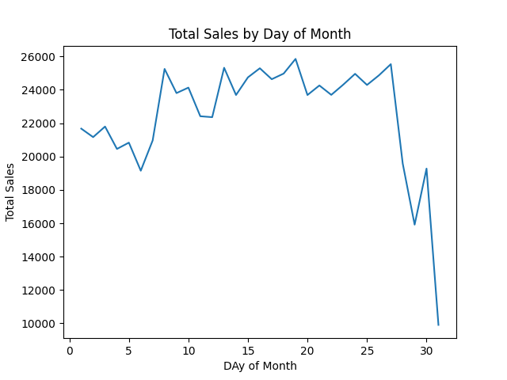
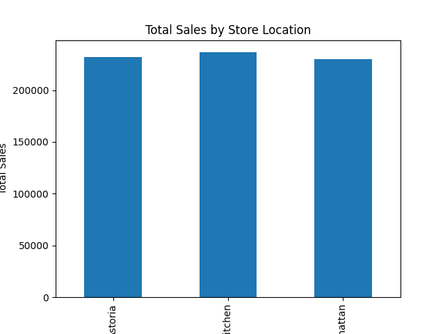

# Coffee Shop Sales Data Analysis with Python
📊 *Exploring customer behavior, popular products, and sales trends to drive better business decisions.*

---

## 📌 Overview
This project analyzes **realistic coffee shop sales data** to uncover patterns in:
- **Customer behavior**
- **Peak sales times**
- **Popular products & categories**
- **Store location performance**

The analysis was performed in **Python** using:
- `pandas` → Data loading, cleaning, and aggregation  
- `matplotlib` → Data visualization  

---

## 💡 Business Questions
We focused on answering:
1. What are the **peak sales hours** of the day?  
2. Are there any noticeable **sales trends** throughout the month?  
3. How does **sales performance** compare across locations?  
4. Which **product categories** are most popular?  
5. What’s the **best-selling item** at each location?  
6. What’s the **total revenue** generated?  

---

## 📂 Data Source
**Coffee Shop Sales.xlsx** — transaction-level sales data including:
- Transaction ID, date, and time  
- Quantity sold  
- Store location  
- Product category and name  
- Unit price  

---

## 🔍 Analysis Workflow

### 1️⃣ Data Loading & Cleaning
- Loaded `.xlsx` into a pandas DataFrame  
- Combined `transaction_date` and `transaction_time` → `datetime` column  
- Extracted `transaction_month`, `transaction_day`, `transaction_hour`  
- Created `total_sales` = `transaction_qty × unit_price`  

### 2️⃣ Exploratory Data Analysis (EDA)
- Reviewed structure with `.head()` & `.info()`  
- Checked missing values and anomalies  

### 3️⃣ Sales Analysis
- **By Hour** → Identified peak hours *(9–10 AM)* 📈  
- **By Day** → Found monthly sales dips near month-end  
- **By Location** → Compared Astoria, Hell's Kitchen, Lower Manhattan  
- **By Category** → Coffee & Tea dominate sales  
- **Best Seller per Location** → Barista Espresso in all locations  
- **Total Revenue** → `$698,812.33`  

---

## 📊 Key Visuals

  
  
  

---

## ⚙️ How to Run

```bash
# Clone the repo
git clone https://github.com/Mehdi83/Coffee_Shop.git
cd Coffee_Shop

# Create virtual environment
python -m venv venv
source venv/bin/activate  # Linux/Mac
venv\Scripts\activate     # Windows

# Install dependencies
pip install -r requirements.txt

# Run analysis
python analysis.py
```

*Outputs will be saved as `.png` in the project directory.*

---

## 🚀 Future Improvements
- Time series forecasting for sales trends  
- Deep dive into specific product subcategories  
- Customer segmentation analysis  

---

## 🛠 Tech Stack
- **Language:** Python 3.x  
- **Libraries:** pandas, matplotlib, openpyxl  
- **Data Source:** Excel dataset  

---

## ✍️ Author
Created by **Mehdi Rafieezadeh** — *Data Analyst*  
📧 mrafizade30@gmail.com


